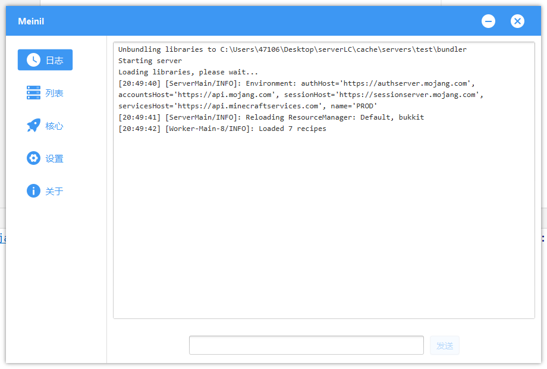

### 基于JavaFX的我的世界启动器

#### 计划支持

1. 设置

   - [x] 日志打印
   - [ ] 执行命令
2. 列表：服务器列表

   - [ ] `server.properties`文件调整
   - [x] 开启/停止服务器
   - [x] 移除服务器
   - [ ] 更换核心
   - [ ] 打开服务器目录
3. 核心：提供主流核心下载

   - [x] `Spigot`
   - [ ] `PaperSpigot`
   - [ ] `Forge`
   - [ ] `Fabric`
   - [ ] `Sponge`
   - [ ] ......
4. 设置：高级参数设置

   - [x] `JAVA_HOME`路径调整
   - [x] `JVM`参数调整
   - [x] 游戏内存调整
5. 关于

   - [x] 开服器详情页

#### 参考资料

[MSL2开服器](https://github.com/Waheal/MSL2)

[JavaFX视频教程](https://space.bilibili.com/5096022/channel/seriesdetail?sid=394169)、[一个JavaFX实战项目](https://space.bilibili.com/397562730)

[JavaFX交流群](https://jq.qq.com/?_wv=1027&k=tYgmJDcH)

#### 预览图

